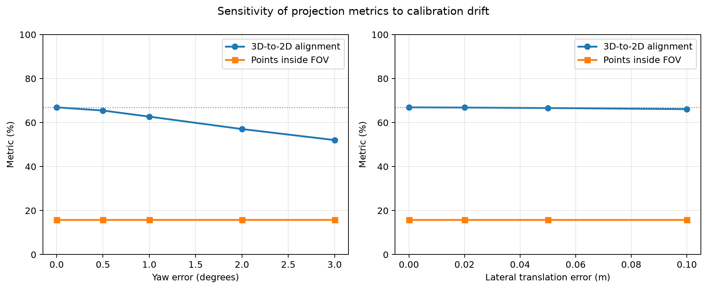
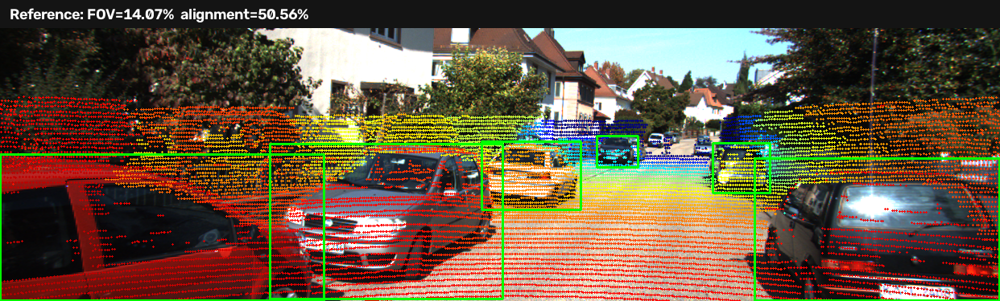
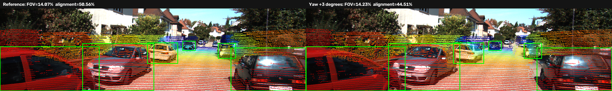

# Báo cáo Day 6: Độ nhạy của phép chiếu LiDAR-camera với calibration drift

- **Họ tên:** Dương Dương
- **MSSV:** 2A202602498
- **Lớp:** AI20K — Track 4
- **Link repo:** https://github.com/duongduong1606/DuongDuong-2A202602498-Track4-Day21
- **Topic:** A — LiDAR-camera projection QA
- **Dataset:** data/synthetic, data/kitti_mini
- **Các frame đã dùng:** 000001, 000004, 000007, 000008, 000009, 000010, 000011, 000012, 000015, 000016, 000019, 000021, 000023, 000025, 000031, 000032, 000043, 000048, 000049, 000061

## 1. Claim

Trên 20 frame KITTI, lệch yaw 1° làm alignment của điểm LiDAR thuộc vật thể giảm từ 66.92% xuống 62.70%,
và ở vật thể xa trên 40 m giảm từ 100.00% xuống 57.98%. Trong khi đó, tỷ lệ toàn bộ điểm nằm trong FOV
chỉ đổi từ 15.740% thành 15.750%, nên chỉ số FOV không đủ nhạy để phát hiện calibration drift.
Sai lệch quay cũng nghiêm trọng hơn dịch ngang: yaw 3° làm alignment giảm 14.87 điểm phần trăm,
trong khi dịch ngang 10 cm chỉ làm giảm 0.81 điểm phần trăm trong tập thử này.

## 2. Evidence

Metric alignment lấy các điểm LiDAR nằm trong GT 3D box ở calibration chuẩn, rồi đo tỷ lệ chính các điểm đó
vẫn chiếu vào 2D box tương ứng sau perturbation. Tổng cộng có 59,671 điểm-vật-thể trên 20 frame.

| Cấu hình / mức perturb | Điểm trong FOV | Alignment tổng | Alignment xa trên 40 m |
|---|---:|---:|---:|
| Baseline | 15.740% | 66.917% | 100.000% |
| Yaw +1° | 15.750% | 62.702% | 57.978% |
| Yaw +3° | 15.760% | 52.044% | 9.637% |
| Dịch ngang +10 cm | 15.746% | 66.106% | 98.894% |

Số liệu đầy đủ: [projection_benchmark.csv](../results/projection_benchmark.csv) và
[projection_summary.csv](../results/projection_summary.csv).

## 3. Failure case

Ở frame 000008, yaw +3° làm alignment giảm từ 50.56% xuống 44.51%, nhưng tỷ lệ điểm trong FOV lại tăng
từ 14.07% lên 14.23%. Vì ảnh vẫn nhận gần như cùng số điểm, FOV metric báo dữ liệu có vẻ bình thường dù
overlay đã lệch khỏi vật thể. Đây là failure thuộc lớp **Metric**: chỉ số đếm điểm không đo đúng mục tiêu
alignment; đồng thời hiệu ứng mạnh hơn ở vật thể xa do cùng một sai số góc tạo dịch chuyển pixel lớn hơn.

## 4. Khuyến nghị nếu triển khai thật

Hệ thống ADAS nên giám sát alignment theo vật thể hoặc theo image/depth edge và phân tầng theo khoảng cách,
không dùng riêng tỷ lệ điểm trong FOV. Có thể cảnh báo sơ bộ khi alignment tổng giảm trên 4 điểm phần trăm
hoặc alignment xa giảm trên 20 điểm phần trăm so với baseline đã hiệu chuẩn, sau đó yêu cầu kiểm tra lại
trên nhiều cảnh trước khi kết luận bracket cảm biến bị lệch. Ngưỡng trên mới được kiểm tra với 20 frame,
vì vậy cần xác nhận thêm ở ban đêm, thời tiết xấu, đường ít vật thể và dữ liệu đồng bộ thời gian thật.

## 5. Cách chạy lại

    python tools/verify_data.py --data-root data/kitti_mini
    python -m starter.projection --data-root data/synthetic --frame 000000
    python -m starter.projection --data-root data/kitti_mini --frame 000011
    python -m src.projection_qa
    python tools/check_submission.py

src/projection_qa.py tự chạy toàn bộ 20 frame, tạo hai CSV, biểu đồ drift, ba overlay và ảnh failure case.

## 6. Khai báo sử dụng AI

| Công cụ | Dùng cho việc gì | Bạn đã kiểm chứng thế nào |
|---|---|---|
| OpenAI Codex | Hỗ trợ cài đặt phép chiếu, thiết kế metric, viết script benchmark, vẽ biểu đồ và rà báo cáo | Chạy kiểm tra điểm LiDAR 10 m, lọc NaN/điểm sau camera, xem trực tiếp overlay, chạy đủ 20 frame, đối chiếu CSV với summary, compile Python và chạy check_submission.py |
